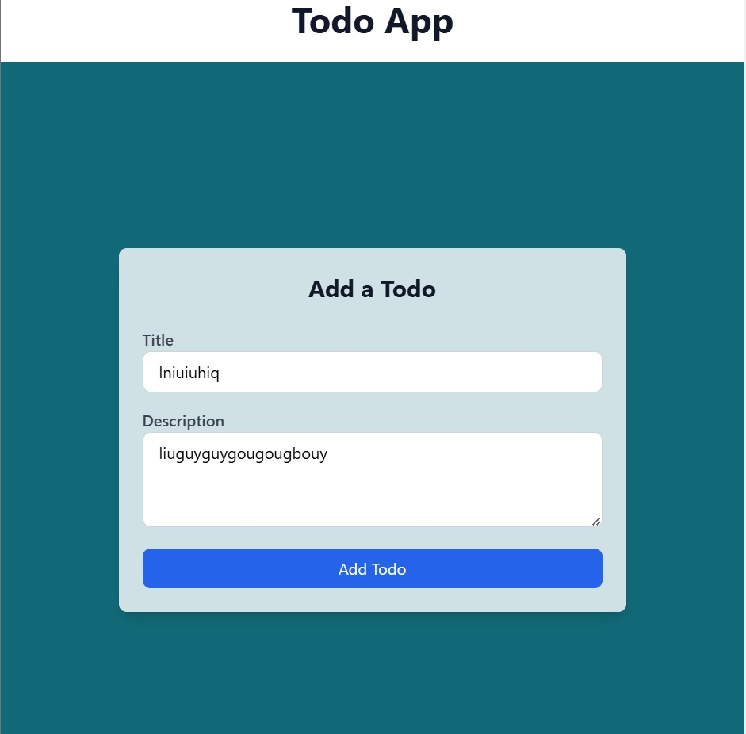
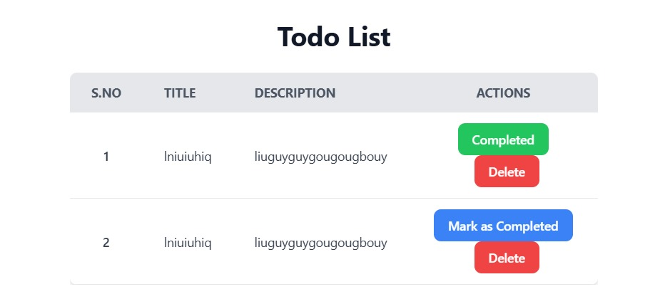

📌 Todo App
A simple and responsive Todo List Application built using React, Tailwind CSS, Express.js, and MongoDB. This app allows users to create, update, and delete their todos efficiently.

🚀 Features

✅ Add a new todo

✅ Mark todos as completed

✅ Delete todos

✅ Responsive UI

✅ MongoDB as Database


🛠️ Tech Stack

Frontend: React, Tailwind CSS

Backend: Node.js, Express.js

Database: MongoDB

State Management: React Hooks

Deployment: Vercel (Frontend), Render (Backend)

📸 Screenshots

📌 Todo List View


📌 Adding a Todo


📌 Marking as Completed


⚡ Installation & Setup
1️⃣ Clone the Repository
```
git clone https://github.com/manojkumar2291/todo-mern.git
cd todo-app
```
2️⃣ Backend Setup
```
cd backend
npm install
```
Create a .env file inside backend/ and add:
```
MONGODB_URI=your_mongo_db_url
BACKEND_URL=http://localhost:5000
```
Start the backend:

```
npm start
```
3️⃣ Frontend Setup
```
cd frontend
npm install
```
Create a .env file inside frontend/ and add:

```
REACT_APP_BACKEND_URL=http://localhost:5000
```
# Start the frontend:

```
npm run dev
```
🌍 Live Demo

🔗 Live Link: [Todo App](https://todo-mern-beryl.vercel.app/)

🔗 GitHub Repo: [GitHub](https://github.com/manojkumar2291/todo-mern)

🤝 Contributing

Feel free to submit issues and pull requests to improve the project!

📜 License

This project is open-source under the MIT License.

💙 Support

If you like this project, leave a ⭐ on GitHub and follow me on LinkedIn! 🚀

